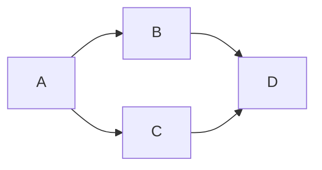

# Saika Mermaid <PkgVersion name="@saika/mermaid" />

> Know about [mermaid](http://mermaid-js.github.io/mermaid/)

Using Mermaid in Saika.

## Usage

Load these plugin via `<script>` tag:

```html
<!-- Load this plugin after saika.js -->
<script src="https://cdn.jsdelivr.net/npm/mermaid/dist/mermaid.min.js"></script>
<script src="https://cdn.jsdelivr.net/npm/@saika/mermaid"></script>
```

This plugin is exposed as `window.saikaMermaid`:

```js
new Saika({
  plugins: [saikaMermaid()]
})
```

## Options

Options for [mermaid.initialize](https://mermaidjs.github.io/#/usage?id=using-the-mermaidapiinitializemermaidinitialize-call).

## Example

````markdown

````

<ImageZoom src="https://i.loli.net/2019/08/27/2oTB5K6pHz3OrIi.png" />
